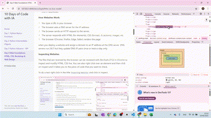
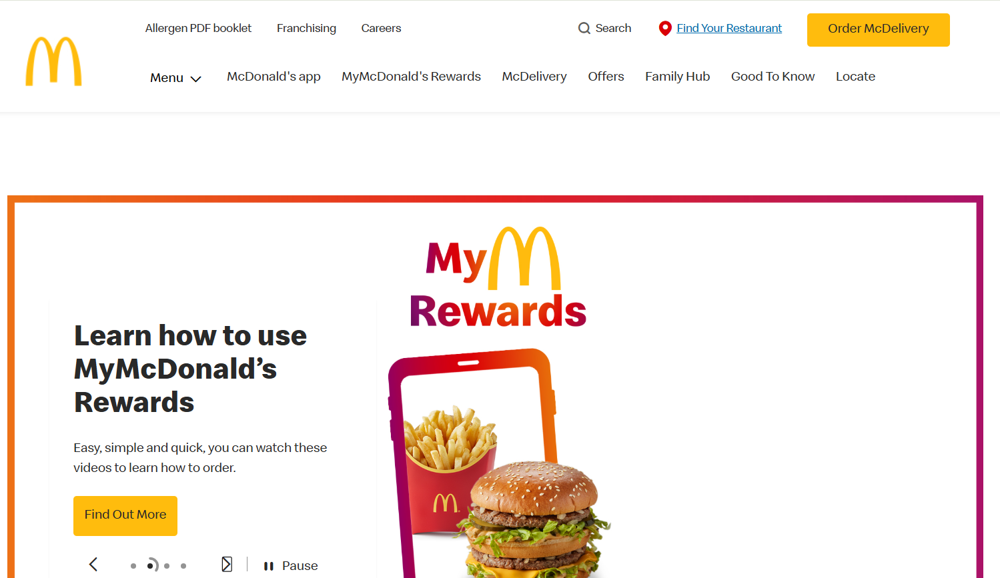
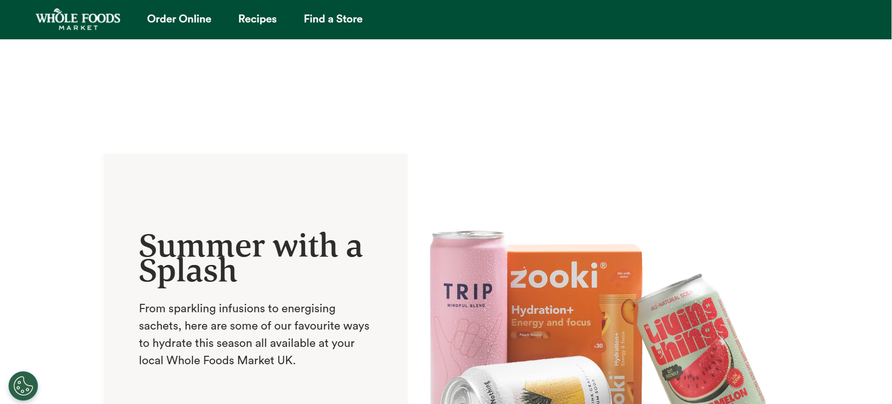
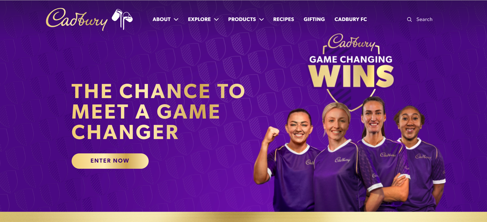
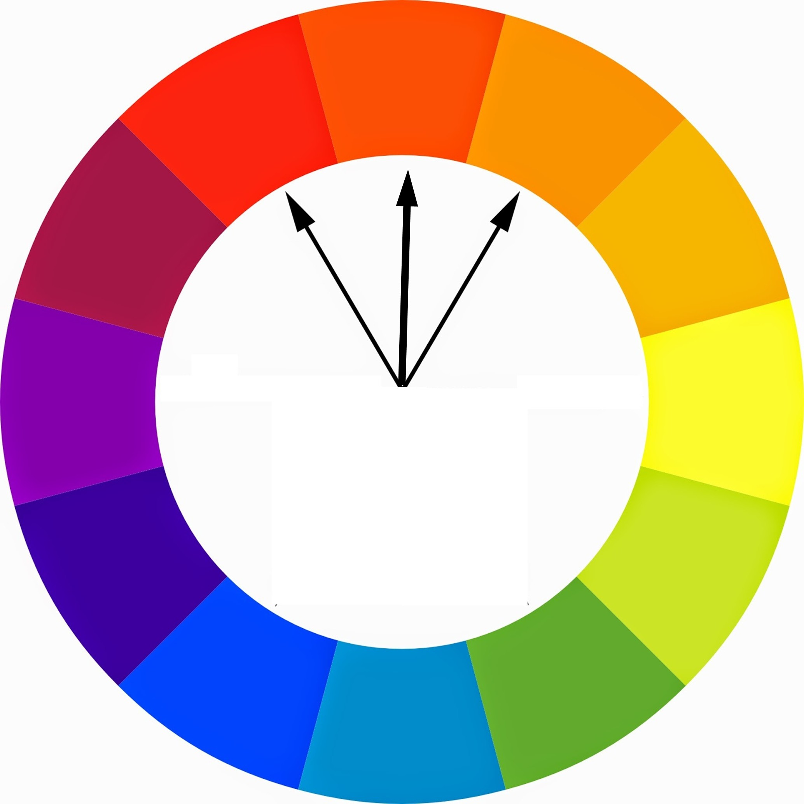
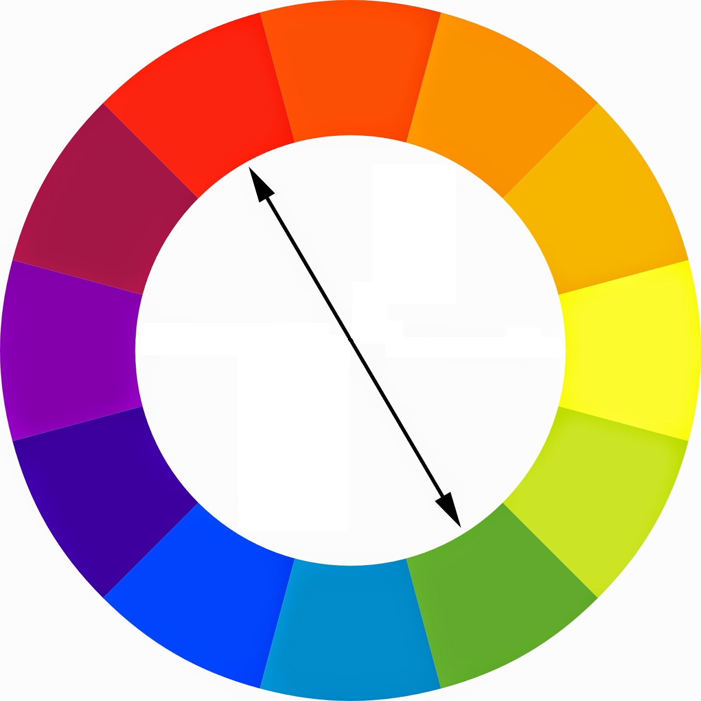
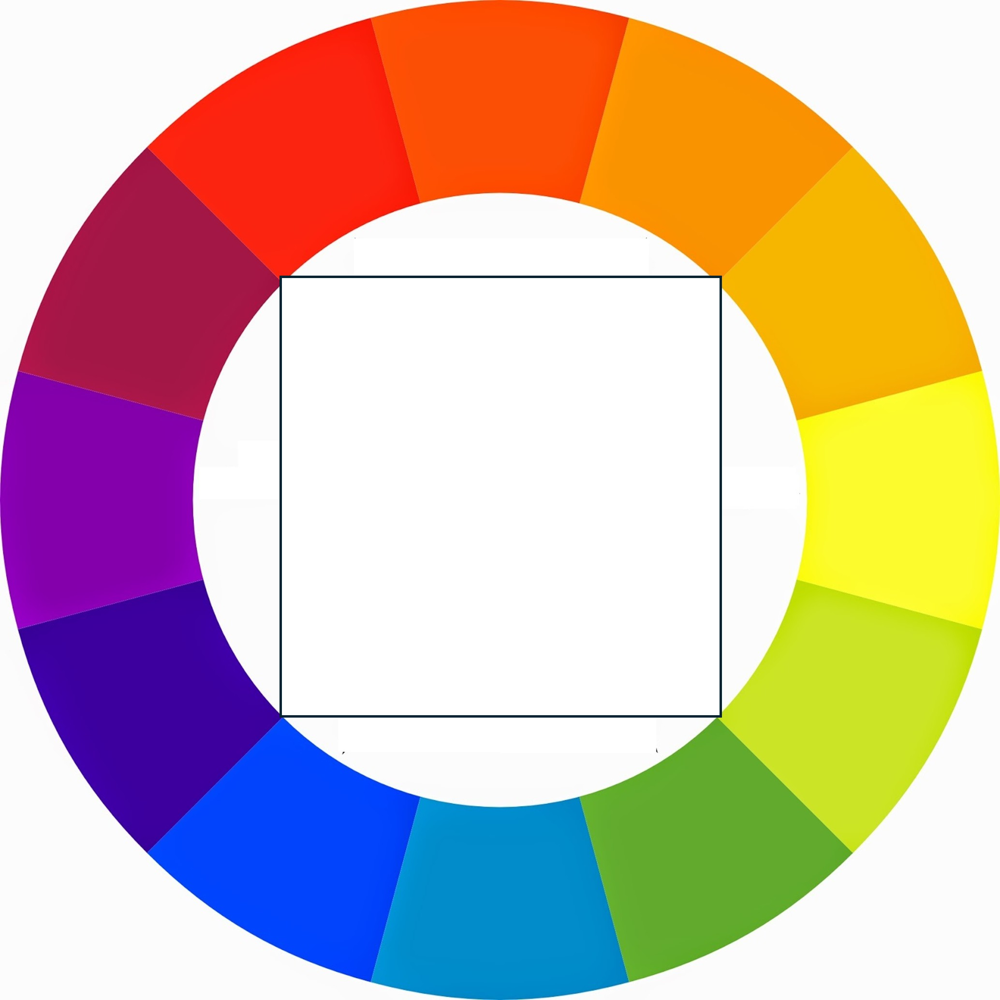

# Día 4. Fundamentos Web. 🕸️ HTML, CSS, Bootstrap y Diseño Web
{: .no_toc }

¡Bienvenido al Día 4! Hoy, construirás una base sólida en el desarrollo web aprendiendo cómo funciona Internet, los fundamentos de HTML y CSS, y cómo usar Bootstrap para un diseño web rápido y atractivo. También cubriremos los conceptos básicos de la teoría del diseño web para ayudarte a crear sitios web que a la gente le encantarán.

---

<details open markdown="block">
  <summary>
    Índice de contenidos
  </summary>
  {: .text-delta }
1. TOC
{:toc}
</details>

---

## 🌐 ¿Cómo funciona realmente Internet?<a href="#top" class="back-to-top-link" aria-label="Back to Top">↑</a>

Antes de construir sitios web, es importante entender cómo Internet conecta a los usuarios y los servidores.

- **Internet**: Una [red global de ordenadores](https://developer.mozilla.org/en-US/docs/Learn_web_development/Howto/Web_mechanics/How_does_the_Internet_work) que se comunican a través de protocolos (TCP/IP).
- **Sitios web**: Alojados en servidores, a los que acceden los clientes (navegadores) a través de [URLs](https://developer.mozilla.org/en-US/docs/Learn_web_development/Howto/Web_mechanics/What_is_a_URL) (Localizador Uniforme de Recursos).
- **HTTP/HTTPS**: Protocolos para transferir datos web.
- **DNS** ([Sistema de Nombres de Dominio](https://developer.mozilla.org/en-US/docs/Learn_web_development/Howto/Web_mechanics/What_is_a_domain_name)): Traduce nombres de dominio amigables para los humanos (como google.com) en direcciones IP.

**Cómo funcionan los sitios web:**
1. Escribes una URL en tu navegador.
2. El navegador solicita a un servidor DNS la dirección IP.
3. El navegador envía una solicitud HTTP al servidor.
4. El servidor responde con HTML (para elementos), CSS (formato), JS (acciones), imágenes, etc.
5. El navegador (Chrome, Firefox, Edge, Safari) renderiza la página.

Cuando despliegas un sitio web y asignas un dominio a una dirección IP en el servidor DNS. Los servidores DNS funcionan 24/7 pero actualizan los pares DNS-IP solo una o dos veces al día.

**Inspeccionando Sitios Web**

Los archivos que recibe el navegador se pueden revisar con las Herramientas de Desarrollo (F12) en Chrome para inspeccionar y modificar HTML y CSS en vivo. También puedes hacer clic con el botón derecho sobre un elemento y luego hacer clic en inspeccionar y te llevará a la parte del código que quieres revisar.

Para hacer una prueba, haz clic con el botón derecho en el título `Inspeccionando Sitios Web` y haz clic en inspeccionar.


El navegador tiene un conjunto de herramientas para inspeccionar elementos (el código html), estilos (el código CSS), una terminal para ejecutar código directamente o ver en qué orden y cuánto tiempo tarda en descargar y ejecutar el código del servidor. También puedes grabar acciones o cargar extensiones. El navegador tiene muchas más posibilidades de las que parece a primera vista.



---


## 📝 HTML: La Estructura de la Web<a href="#top" class="back-to-top-link" aria-label="Back to Top">↑</a>

### ¿Qué es HTML?<a href="#top" class="back-to-top-link" aria-label="Back to Top">↑</a>

- **HTML (HyperText Markup Language)** es el lenguaje estándar para crear páginas web que pueden ser renderizadas por la mayoría de los navegadores. Estructura el contenido utilizando **elementos** (etiquetas) como `<title>Mi Primera Página Web</title>` de una manera estática y sin formato.
Generalmente las etiquetas tienen una etiqueta de apertura como `<details></details>`, pero algunas etiquetas no necesitan una etiqueta de cierre, p. ej. `` para imágenes, `<br>` para nueva línea, `<hr>` para una línea horizontal.

### Plantilla HTML<a href="#top" class="back-to-top-link" aria-label="Back to Top">↑</a>

Toda página HTML comienza con una estructura básica:

```html
<!DOCTYPE html>
<html lang="en">
<head>
  <meta charset="UTF-8">
  <title>Mi Primera Página Web</title>
</head>
<body>
  <!-- El contenido va aquí -->
   ¡Hola Mundo!
</body>
</html>
```

### Encabezados, Párrafos y Listas<a href="#top" class="back-to-top-link" aria-label="Back to Top">↑</a>
Los [elementos más básicos](https://developer.mozilla.org/en-US/docs/Learn_web_development/Howto/Solve_HTML_problems) son los encabezados o títulos (hay 7 de ellos), párrafos y listas. Puedes encontrar la lista completa de elementos en [W3Schools](https://www.w3schools.com/html/default.asp)

Prueba y juega con el código de abajo en la [prueba web de html de W3Schools](https://www.w3schools.com/html/tryit.asp?filename=tryhtml_basic)

```html
<!DOCTYPE html>
<html lang="en">
<head>
  <meta charset="UTF-8">
  <title>Mi Primera Página Web</title>
</head>
<body>
  <h1>Encabezado Principal</h1>
  <h2>Subencabezado</h2>
  <p>Este es un párrafo de texto.</p>

  <ul>
    <li>Elemento de lista no ordenada</li>
  </ul>
  <ol>
    <li>Elemento de lista ordenada</li>
  </ol>
</body>
</html>
```

### Elementos de Ancla e Imagen<a href="#top" class="back-to-top-link" aria-label="Back to Top">↑</a>
Los elementos de ancla se utilizan para crear enlaces. Las imágenes se incluyen con la etiqueta ``. Se recomienda incluir una descripción por accesibilidad.

```html
<a href="https://www.example.com">Visitar Ejemplo</a>

```

### Anidamiento e Indentación<a href="#top" class="back-to-top-link" aria-label="Back to Top">↑</a>

Los elementos HTML se pueden anidar. Se recomienda escribirlos con una indentación adecuada para mejorar la legibilidad.

```html
<ul>
  <li>
    <a href="#">Enlace Anidado</a>
  </li>
</ul>
```

### Formularios<a href="#top" class="back-to-top-link" aria-label="Back to Top">↑</a>

Los formularios se utilizan para recopilar la entrada del usuario en una página web. Cada formulario puede tener etiquetas, campos de entrada y marcadores de posición para guiar al usuario, así como botones para enviar la información.

Ejemplo:
```html
<form>
  <label for="name">Nombre:</label>
  <input type="text" id="name" name="name" placeholder="Introduce tu nombre">
  <button type="submit">Enviar</button>
</form>
```

### Estilos<a href="#top" class="back-to-top-link" aria-label="Back to Top">↑</a>

Puedes dar estilo a los elementos HTML en línea usando el atributo `style` directamente en la etiqueta. Esto se llama estilo en línea. Por ejemplo, puedes cambiar el tamaño de la fuente, la alineación del texto, el color y más.

Ejemplo:
```html
<p style="font-size:18px; text-align:center; color:blue; font-family:Arial;">Este es un párrafo con estilo.</p>
```

En lugar de asignar los estilos etiqueta por etiqueta, lo que sería desordenado y llevaría mucho tiempo, las etiquetas se asignan a clases y/o IDs y luego los estilos para las clases o IDs se especifican en un archivo CSS como se explica más adelante.


### Elementos HTML con IDs y Clases<a href="#top" class="back-to-top-link" aria-label="Back to Top">↑</a>

Tanto los IDs como las clases son atributos que se pueden agregar a los elementos HTML para que sean seleccionables para el estilo CSS o la manipulación de JavaScript. Las diferencias clave:

- **ID**: Debe ser único en la página (solo un elemento debe tener un ID específico)
- **Clase**: Se puede reutilizar en múltiples elementos

```html
<h2 id="welcome-title" class="section-title">Bienvenido a Mi Sitio Web</h2>
<p id="intro-text" class="content-paragraph">Este párrafo tiene tanto un ID como una clase.
El ID "intro-text" solo se puede usar una vez en esta página, mientras que la clase "content-paragraph"
se puede aplicar a múltiples elementos de párrafo.</p>
```

En CSS, seleccionarías estos elementos usando:
```css
/* Seleccionar por ID (usa el símbolo #) */
#welcome-title {
  color: navy;
  font-size: 28px;
}

#intro-text {
  font-style: italic;
}

/* Seleccionar por clase (usa el símbolo .) */
.section-title {
  border-bottom: 2px solid #ccc;
  padding-bottom: 10px;
}

.content-paragraph {
  line-height: 1.6;
  margin-bottom: 20px;
}
```


### Divs<a href="#top" class="back-to-top-link" aria-label="Back to Top">↑</a>
El elemento HTML `<div>` es un contenedor genérico para contenido de flujo. Es una "división" o "sección" de una página web. Se utilizan para agrupar otros elementos HTML.

### Plantilla HTML completa<a href="#top" class="back-to-top-link" aria-label="Back to Top">↑</a>

<details markdown="block">
  <summary>
    Para una vista de exhibición completa de todos los tipos de elementos HTML, vea el código a continuación.
  </summary>

Esto se puede visualizar en [Prueba web de html de W3Schools](https://www.w3schools.com/html/tryit.asp?filename=tryhtml_basic)


```html
placeholder
```


</details>

---

## 🎨 CSS: Estilizando la Web<a href="#top" class="back-to-top-link" aria-label="Back to Top">↑</a>

### ¿Por qué necesitamos CSS?<a href="#top" class="back-to-top-link" aria-label="Back to Top">↑</a>
CSS (Hojas de Estilo en Cascada) controla la apariencia de los elementos HTML. Separa el contenido (HTML) de la presentación (CSS).

### Añadiendo CSS<a href="#top" class="back-to-top-link" aria-label="Back to Top">↑</a>

**En línea:**
```html
<p style="color: red;">Texto rojo</p>
```

**Interno:**
Cuando configuras una lista de estilos en el archivo HTML para aplicarlos a todos los elementos.
```html
<head>
  <style>
    p { color: blue; } // Aplica a todos los párrafos
  </style>
</head>
```

**Externo:**
En un archivo CSS que se enlaza en el HTML como se muestra a continuación.
```html
<link rel="stylesheet" href="styles.css">
```

### Selectores y Propiedades de CSS<a href="#top" class="back-to-top-link" aria-label="Back to Top">↑</a>

Los selectores te permiten dirigirte a elementos específicos, grupos de elementos o elementos basados en sus atributos, estados o relaciones con otros elementos.

#### Selectores Simples<a href="#top" class="back-to-top-link" aria-label="Back to Top">↑</a>


<details markdown="block">
  <summary>
    Selector Universal (*)
  </summary>
Selecta todos los elementos de la página.

```css
* {
  box-sizing: border-box;
}
```

</details>

<details markdown="block">
  <summary>
    Selector de Elemento
  </summary>
Selecta todos los elementos HTML de un tipo específico (nombre de etiqueta).

```css
p {
  font-size: 16px;
}
```

</details>

<details markdown="block">
  <summary>
    Selector de Clase (.nombre_clase)
  </summary>
Selecta todos los elementos con un atributo de clase específico.

```css
.my-class {
  color: blue;
}
```

</details>

<details markdown="block">
  <summary>
    Selector de ID (#nombre_id)
  </summary>
Selecta un solo elemento con un atributo id específico. Los IDs deben ser únicos dentro de una página.

```css
#header {
  background-color: gray;
}
```
</details>

#### Selectores de Combinación<a href="#top" class="back-to-top-link" aria-label="Back to Top">↑</a>
Los combinadores te permiten seleccionar elementos en función de su relación con otros elementos en el árbol del documento.

<details markdown="block">
  <summary>
    Selector de Descendiente
  </summary>

```css
div p {
  margin-bottom: 10px;
} /* Selecciona todos los párrafos dentro de cualquier div */
```

</details>

<details markdown="block">
  <summary>
    Selector de Hijo
  </summary>

```css
ul > li {
  list-style-type: none;
} /* Selecciona todos los elementos li que son hijos directos de un ul */
```
</details>

#### Selectores de Atributo<a href="#top" class="back-to-top-link" aria-label="Back to Top">↑</a>
Ellos seleccionan elementos en función de sus atributos.

<details markdown="block">
  <summary>
    Selector de Presencia ([atributo])
  </summary>

Selecta elementos que tienen el atributo especificado.

```css
[data-tooltip] {
  position: relative;
}
```
</details>

<details markdown="block">
  <summary>
    Selector de Valor de Atributo ([atributo="valor"])
  </summary>

Selecta elementos donde el valor del atributo es exactamente igual a "valor".

```css
input[type="text"] {
  border: 1px solid #ccc;
}
```

</details>

#### Pseudo-clases<a href="#top" class="back-to-top-link" aria-label="Back to Top">↑</a>
Selecciona elementos en base a un estado, condición o posición específica.


<details markdown="block">
  <summary>
    Pseudo-clases de acción del usuario
  </summary>

`:hover:` Cuando el puntero está sobre un elemento.

`:active:` Cuando un elemento se activa (por ejemplo, al hacer clic).

`:focus:` Cuando un elemento tiene el foco.

`:visited:` Para enlaces ya visitados.

`:link:` Para enlaces no visitados.

</details>

<details markdown="block">
  <summary>
    Pseudo-clases estructurales
  </summary>

`:first-child:` Selecciona el primer hijo de su elemento padre.

`:last-child:` Selecciona el último hijo de su elemento padre.

`:nth-child(n):` Selecciona el enésimo hijo (se puede usar even, odd o fórmulas como 2n+1).

`:first-of-type:` Selecciona el primer elemento de su tipo entre sus hermanos.

`:last-of-type:` Selecciona el último elemento de su tipo.

`:nth-of-type(n):` Selecciona el enésimo elemento de su tipo.

`:only-child:` Selecciona un elemento que es el único hijo.

`:only-of-type:` Selecciona un elemento que es el único de su tipo.

`:empty:` Selecciona elementos sin hijos (incluyendo nodos de texto).

`:root:` Selecciona el elemento raíz (normalmente <html>).

</details>


<details markdown="block">
  <summary>
    Pseudo-clases de formularios
  </summary>

`:checked:` Para botones de opción o casillas marcadas.

`:disabled:` Para elementos de entrada deshabilitados.

`:enabled:` Para elementos de entrada habilitados.

`:required:` Para campos requeridos.

`:optional:` Para campos sin el atributo requerido.

`:valid:` Para campos con valores válidos.

`:invalid:` Para campos con valores inválidos.

</details>

<details markdown="block">
  <summary>
    Otras pseudo-clases
  </summary>

`:not(selector):` Selecciona elementos que NO coinciden con el selector dado.

`:has(selector):` Selecciona elementos que contienen al menos un elemento que coincide (experimental).

`:is(selector-list):` Coincide con cualquier elemento de una lista separada por comas.

`:where(selector-list):` Similar a :is() pero sin aumentar la especificidad.

</details>

#### Pseudo-elementos<a href="#top" class="back-to-top-link" aria-label="Back to Top">↑</a>
Para partes específicas de un elemento, se utilizan con doble dos puntos (::).


<details markdown="block">
  <summary>
    Otros pseudo-elementos
  </summary>

`::before:` Inserta contenido antes del elemento.

`::after:` Inserta contenido después del elemento.

`::first-letter:` Selecciona la primera letra de un bloque.

`::first-line:` Selecciona la primera línea de un bloque.

`::selection:` Selecciona la parte resaltada.

`::marker:` Selecciona el marcador de un elemento de lista.

`::placeholder:` Selecciona el texto del placeholder en un campo de entrada.

</details>


### Colores en CSS<a href="#top" class="back-to-top-link" aria-label="Back to Top">↑</a>
Los colores se pueden expresar de varias formas:

- Colores por nombre (por ejemplo, "red", "blue")
- Hexadecimal (por ejemplo, "#ff5733")
- RGB (por ejemplo, "rgb(255, 87, 51)")

### Propiedades de Fuente<a href="#top" class="back-to-top-link" aria-label="Back to Top">↑</a>
Existen dos tipos principales de fuentes en CSS:
- Fuentes del sistema (o seguras para la web)
- Fuentes web (o personalizadas)

Ejemplo:
```css
body {
  font-family: 'Roboto', sans-serif;
  font-size: 16px;
  font-weight: 400;
}
```

### El Modelo de Caja de CSS<a href="#top" class="back-to-top-link" aria-label="Back to Top">↑</a>
Cada elemento es representado como una caja rectangular. El modelo describe:

- Contenido: El contenido real.
- Relleno: Espacio entre el contenido y el borde.
- Borde: La línea que envuelve al contenido y relleno.
- Margen: Espacio fuera del borde.

Visualmente:
```
|  Margen  |
| [Borde   |
| | Relleno|
| | Contenido|
```
Ejemplo:
```css
div {
  margin: 20px;      /* Espacio fuera del borde */
  padding: 10px;     /* Espacio dentro del borde */
  border: 2px solid #333; /* Borde alrededor del elemento */
}
```


---

## 🚀 Introducción a JavaScript<a href="#top" class="back-to-top-link" aria-label="Back to Top">↑</a>

JavaScript es el lenguaje de programación que da vida a las páginas web. Mientras HTML proporciona la estructura y CSS se encarga de la apariencia, JavaScript permite la interactividad, contenido dinámico y lógica en el lado del cliente. Tiene una lista extensa de comandos, módulos y frameworks que no se explican aquí. Se puede usar tanto en el Frontend como en el Backend; cubriremos algunos conceptos básicos para identificarlo al inspeccionar sitios web.

### ¿Qué puede hacer JavaScript?<a href="#top" class="back-to-top-link" aria-label="Back to Top">↑</a>
- Responder a las acciones del usuario (clics, escritura, movimiento del ratón)
- Cambiar el contenido o estilo de una página sin recargarla
- Validar formularios antes de enviarlos
- Crear elementos interactivos como sliders, modales y pestañas
- Obtener datos de servidores y actualizar la página (AJAX, APIs)
- Crear juegos, animaciones ¡y mucho más!

### Cómo utilizar JavaScript<a href="#top" class="back-to-top-link" aria-label="Back to Top">↑</a>
Puedes añadir JavaScript de tres formas:
- **En línea:** Directamente en el atributo de un elemento HTML (no recomendado para código complejo)
- **Interno:** Dentro de una etiqueta <script> en el archivo HTML
- **Externo:** En un archivo .js separado enlazado al HTML

Ejemplo (en línea):
```html
<button onclick="alert('¡Hola!')">Haz clic</button>
```

Ejemplo (interno):
```html
<script>
  function saludar() {
    alert('¡Hola desde JavaScript!');
  }
</script>
<button onclick="saludar()">Saludar</button>
```

Ejemplo (externo):
```html
<script src="script.js"></script>
```

### Pruébalo tú mismo<a href="#top" class="back-to-top-link" aria-label="Back to Top">↑</a>
Abre las Herramientas de Desarrollo de tu navegador (F12), ve a la pestaña Consola y escribe:
```js
console.log('¡Hola, mundo!');
```

---

## 💡 Bootstrap: Diseño Web Rápido<a href="#top" class="back-to-top-link" aria-label="Back to Top">↑</a>

#### ¿Qué es Bootstrap?<a href="#top" class="back-to-top-link" aria-label="Back to Top">↑</a>

Es un popular framework CSS para construir sitios web responsivos y mobile-first de forma rápida. Incluye componentes predefinidos (botones, barras de navegación, tarjetas) y un sistema de grillas.

#### Diseño con Bootstrap<a href="#top" class="back-to-top-link" aria-label="Back to Top">↑</a>
Los estilos de Bootstrap se incluyen como referencia en tu archivo HTML. Puedes enlazar directamente al repositorio en la nube o descargar una copia y guardarla junto al resto de tus archivos.
```html
<link rel="stylesheet" href="https://cdn.jsdelivr.net/npm/bootstrap/dist/css/bootstrap.min.css">
<div class="container">
  <div class="row">
    <div class="col-md-6">Columna 1</div>
    <div class="col-md-6">Columna 2</div>
  </div>
</div>
```

#### Componentes de Bootstrap<a href="#top" class="back-to-top-link" aria-label="Back to Top">↑</a>
Bootstrap incluye:
- Botones: `<button class="btn btn-primary">Clic</button>`
- Alertas: `<div class="alert alert-success">¡Éxito!</div>`
- Barras de navegación, tarjetas, formularios y más.

<details markdown="block">
  <summary>
    Código de plantilla Bootstrap
  </summary>

Esta plantilla fue generada con Gemini con el prompt: `can you write an html code with all types of HTML/css elements in a template fashion to showcase what can be done in Bootstrap?`

Puedes visualizar este código en [Prueba web de html de W3Schools](https://www.w3schools.com/html/tryit.asp?filename=tryhtml_basic)<br>


```html
placeholder
```


</details>

<details>
  <summary>
    Plantilla Bootstrap Renderizada
  </summary>

```
placeholder
```

</details>


### Markdown, Jekyll y Ruby<a href="#top" class="back-to-top-link" aria-label="Back to Top">↑</a>

#### ¿Qué es Markdown?

Markdown es un lenguaje de marcado ligero para dar formato a texto usando una sintaxis de texto plano. Está diseñado para ser fácil de leer y escribir, y se utiliza ampliamente para documentación, archivos README y generadores de sitios estáticos.

**Sintaxis básica de Markdown:**
- Encabezados: `# Encabezado 1`, `## Encabezado 2`, ..., hasta `###### Encabezado 6`
- Negrita: `**texto en negrita**` o `__texto en negrita__`
- Cursiva: `*texto en cursiva*` o `_texto en cursiva_`
- Listas:  
  - No ordenadas: `- elemento` o `* elemento`
  - Ordenadas: `1. elemento`
- Enlaces: `[texto del enlace](https://ejemplo.com)`
- Imágenes: ``
- Código:  
  - En línea: `` `código` ``
  - Bloque:  
    ```
    bloque de código
    ```
- Cita: `> texto citado`

**Diferencias con HTML:**
- Markdown es más simple y legible en su forma original.
- HTML es más potente y flexible, pero más extenso.
- Markdown puede convertirse a HTML, pero no todas las características de HTML están disponibles en Markdown.

Para una referencia completa, consulta la [Guía de Markdown](https://www.markdownguide.org/basic-syntax/).

#### Jekyll y Ruby

[Jekyll](https://jekyllrb.com/) es un generador de sitios estáticos que convierte archivos Markdown en sitios web HTML. Es el motor detrás de GitHub Pages, lo que te permite publicar documentación o blogs directamente desde un repositorio de GitHub de forma gratuita. Jekyll está escrito en el lenguaje de programación Ruby.

#### Este sitio web

Este sitio web está construido usando el tema [just-the-docs](https://just-the-docs.github.io/), que es un tema basado en Jekyll diseñado para sitios de documentación.


---

## 🎨 Escuela de Diseño Web: Cómo Crear un Sitio Web que la Gente Ame<a href="#top" class="back-to-top-link" aria-label="Back to Top">↑</a>

### Introducción al Diseño Web<a href="#top" class="back-to-top-link" aria-label="Back to Top">↑</a>

El diseño web es mucho más que escribir código limpio: se trata de crear una experiencia visual y emocional que conecte con tus usuarios. Un diseño exitoso invita a las personas, cuenta una historia y las guía sin esfuerzo hacia un objetivo. En esta guía, exploramos los cuatro pilares del diseño web efectivo: **Teoría del Color, Tipografía, Interfaz de Usuario (UI) y Experiencia de Usuario (UX)**. Una vez que domines estos, estarás listo para crear sitios web hermosos y centrados en las personas.

---

### 🎨 Entendiendo la Teoría del Color<a href="#top" class="back-to-top-link" aria-label="Back to Top">↑</a>

El color no es solo decoración: transmite significado, influye en el estado de ánimo e incluso puede afectar el comportamiento. Aquí tienes principios clave:

- **La consistencia es clave**: Evita colores que choquen. En su lugar, elige paletas que se alineen con tu marca y mensaje.
- **Cuenta una historia con el color**:
  - 🔴**Rojo**: pasión, energía, urgencia—ideal para marcas orientadas a la acción.
> *Ejemplo:* <a href="https://www.coca-cola.com/" target="_blank">Coca-Cola</a>

> *Por qué funciona:* La marca Coca-Cola trata sobre emoción, diversión y frescura. El rojo intenso transmite energía y urgencia, haciéndola sentir dinámica e icónica.
  - 🟡**Amarillo**: optimismo, intelecto, atención—eficaz para captar interés pero evita usarlo en grandes fondos.
> *Ejemplo:* <a href="https://www.mcdonalds.com/" target="_blank">McDonald’s</a>
  
> *Por qué funciona:* McDonald's usa el amarillo para captar la atención y transmitir felicidad y amabilidad. Es especialmente efectivo en logotipos y acentos, sin saturar el fondo.
  - 🟢 **Verde**: frescura, seguridad—ideal para negocios ecológicos o relacionados con alimentos.
> *Ejemplo:* <a href="https://www.wholefoodsmarket.com/" target="_blank">Whole Foods Market</a> 
  
> *Por qué funciona:* Whole Foods enfatiza la salud, la naturaleza y la sostenibilidad. El verde refuerza su compromiso con alimentos frescos, orgánicos y prácticas conscientes con el medio ambiente.
  - 🔵 **Azul**: confianza, calma—popular en empresas financieras y tecnológicas.
> *Ejemplo:* <a href="https://www.paypal.com/" target="_blank">PayPal</a>   
 
> *Por qué funciona:* El azul es el color dominante en el diseño de PayPal, evocando confianza, seguridad y profesionalismo—crítico para un proveedor de servicios financieros. 
  - 🟣 **Púrpura**: realeza, feminidad—usado a menudo en productos de lujo y belleza.
> *Ejemplo:* <a href="https://www.cadbury.co.uk/" target="_blank">Cadbury</a>  
  
> *Por qué funciona:* Cadbury utiliza un púrpura intenso para reflejar lujo e indulgencia. El color también ayuda a distinguir sus productos y añade una sensación de calidad premium.

- **Usa paletas científicas**:
  - **Análogas**: armoniosas, colores contiguos en la rueda de color.
    
  - **Complementarias**: opuestas en la rueda—llamativas, pero mejor para acentos, no para texto.
     
  - **Paletas triádicas y cuadradas**: bien equilibradas y vibrantes.
    <div style="display: flex; justify-content: center; gap: 20px;">
      
      
    </div>

- **Utiliza herramientas profesionales**:
  - <a href="https://color.adobe.com/" target="_blank">Adobe Color</a>: para crear temas de color y transferirlos a tu contenido
  - <a href="https://coolors.co/" target="_blank">Coolors</a>: paletas de colores predefinidas
  - <a href="https://colorhunt.co" target="_blank">Color Hunt</a>: paletas de colores predefinidas

Elige combinaciones de colores que reflejen el propósito de tu sitio web. Una buena paleta hace que tu diseño se sienta intencionado, coherente y memorable.

---

### ✍️ Entendiendo la Tipografía<a href="#top" class="back-to-top-link" aria-label="Back to Top">↑</a>

La tipografía guía el recorrido del lector. Una gran tipografía aporta claridad y estado de ánimo a tu contenido.

- **Elige fuentes legibles**: Prioriza la legibilidad en todos los tamaños de pantalla.
- **Limita a 2–3 familias tipográficas**: Demasiadas pueden abrumar y distraer. 
  - <strong>Fuentes serif</strong> (como <span style="font-family: 'Georgia', serif;">Georgia</span> o <span style="font-family: 'Times New Roman', serif;">Times New Roman</span>) tienen pequeños adornos decorativos, o "pies", al final de sus letras, dando una sensación tradicional y elegante, usada a menudo en impresión.<br>
  - <strong>Fuentes sans-serif</strong> (como Arial) carecen de estos adornos, ofreciendo un aspecto limpio, moderno y minimalista que es muy legible, especialmente en pantallas digitales.<br>
  - La elección entre ellas depende a menudo del medio (impresión vs. digital) y del estado de ánimo deseado (clásico vs. moderno).
- **Establece jerarquía**:
  - Usa tamaño, peso (negrita vs. regular) y espaciado para indicar importancia.
  - Combina fuentes serif (<span style="font-family: 'Georgia', serif;">clásicas, establecidas</span>) con sans-serif (modernas, limpias) para contraste.
- **Considera el tono de tu marca**: Una <span style="font-family: 'Times New Roman', serif;">fuente serif</span> transmite tradición, mientras que una sans-serif en negrita se siente tecnológica. Usa script para algo más <span style="font-family: 'Dancing Script', cursive;">personal</span> o <span style="font-family: 'Great Vibes', cursive;">elegante</span>. 

El diseño es comunicación: tus elecciones tipográficas deben ayudar a los usuarios a absorber tu mensaje, no luchar contra él.

---

### 👁️ Gestionando la Atención con el Diseño UI<a href="#top" class="back-to-top-link" aria-label="Back to Top">↑</a>

Tus usuarios no leen, escanean. El diseño UI consiste en guiar su atención hacia lo que más importa.

#### ✅ Jerarquía
- Los elementos más grandes y en negrita se notan primero.
- Usa **contraste de color** y **<span style="font-size: larger;">tamaño</span>** para destacar lo importante—como un botón verde "Comprar ahora" en un diseño en escala de grises.

#### 🧱 Maquetación
- Divide bloques de texto con imágenes y espacios en blanco.
- Longitud ideal de línea: **40–60 caracteres** para facilitar la lectura.
- Evita muros de texto abrumadores como los de Wikipedia.

#### 📐 Alineación
- Alinea los elementos para crear estructura.
- Reduce la cantidad de puntos de alineación—la uniformidad hace que tu diseño se vea más profesional.

#### 🌌 Espacio en Blanco
- El vacío añade elegancia. Los diseños de alta gama (piensa en Apple) usan el espacio en blanco para sugerir valor y claridad.
- No satures tu contenido—deja que cada elemento respire.

#### 🧑‍🎨 Diseña para tu Audiencia
- Un sitio para niños debe verse diferente a uno financiero.
- Ajusta color, maquetación y fuente a las expectativas y deseos de tu usuario.

Cuando el UI está bien hecho, los usuarios ni lo notan—simplemente navegan felices por tu sitio.

---

### 💡 Diseño de Experiencia de Usuario (UX)<a href="#top" class="back-to-top-link" aria-label="Back to Top">↑</a>

UX trata sobre la **empatía**—diseñar pensando en el recorrido de tu usuario. Pregúntate: ¿Pueden los usuarios encontrar lo que necesitan fácilmente? ¿Pueden interactuar cómodamente en todos los dispositivos?

- **Haz la navegación intuitiva**: Usa patrones familiares como barras de navegación superiores o menús tipo hamburguesa.
- **Diseño responsivo**: Tu sitio debe verse bien en móviles, tabletas y ordenadores.
- **Prueba temprano y seguido**: Obtén retroalimentación de usuarios reales. Observa cómo interactúan y mejora en base a su comportamiento—no a tus suposiciones.

Piensa en UX como un andamiaje invisible—no es glamuroso, pero sostiene todo tu diseño.


---

## 🏁 Resumen<a href="#top" class="back-to-top-link" aria-label="Back to Top">↑</a>

Hoy aprendiste:
- Cómo funciona Internet y los sitios web
- Estructura y elementos de HTML
- Estilizado con CSS y el modelo de caja
- Cómo usar Bootstrap para un diseño rápido y responsivo
- Principios clave de diseño web para sitios hermosos y fáciles de usar

**Próximos pasos:** ¡Intenta construir una página web simple usando HTML, dale estilo con CSS y experimenta con componentes de Bootstrap! Puedes acelerar tu diseño usando <a href="https://www.canva.com/" target="_blank">Canva</a>, que te permite diseñar un sitio web en tu navegador, publicarlo y luego ver su código.

- **Diseño responsivo**: Tu sitio web debe verse genial en teléfonos, tabletas y computadoras de escritorio.
- **Prueba temprano y seguido**: Obtén retroalimentación de usuarios reales. Observa cómo interactúan y mejora tu sitio en base a su comportamiento, no a tus suposiciones.

Piensa en la UX como un andamiaje invisible: no es glamuroso, pero sostiene todo tu diseño


---

## 🏁 Resumen<a href="#top" class="back-to-top-link" aria-label="Back to Top">↑</a>

Hoy aprendiste:
- Cómo funciona Internet y los sitios web
- Estructura y elementos de HTML
- Estilizado con CSS y el modelo de caja
- Cómo usar Bootstrap para un diseño rápido y responsivo
- Principios clave de diseño web para sitios hermosos y fáciles de usar

**Próximos pasos:** Intenta construir una página web simple usando HTML, dale estilo con CSS y experimenta con componentes de Bootstrap. ¡Puedes acelerar tu diseño usando <a href="https://www.canva.com/" target="_blank">Canva</a>, que te permite diseñar un sitio web en tu navegador, publicarlo y luego ver su código!
